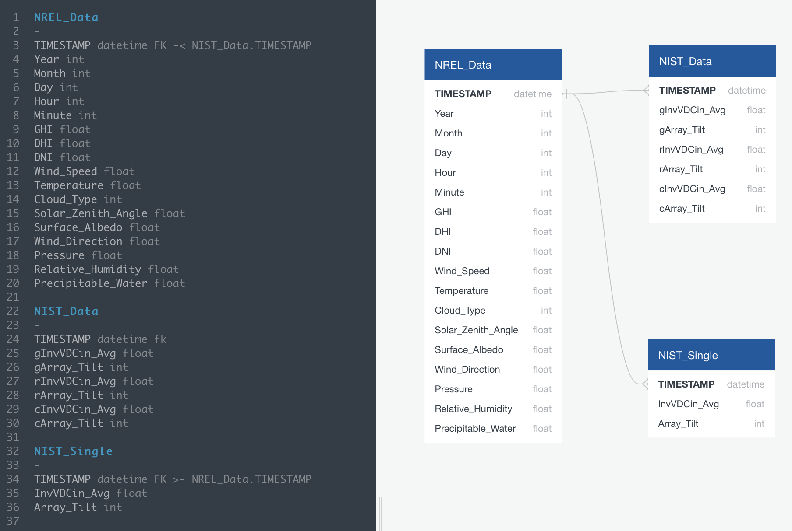

# Solar Panel Potential Energy

## Selected Topic:

### A study of how natural factors such as solar irradiance, solar angle, cloud cover, rainfall and more effect solar panel power generation.

## Reason why we selected the topic:

The reason we selected this topic is to hopefully encourage state governments and buisnesses to invest in solar energy stations and solar technology. We would like to show how location and weather patterns can inform the potential for solar panel electrical generation.  We propose building a machine learning model that takes solar irradiance, temperature, wind, cloud cover and solar angle into account to provide an estimate of solar panel generation potential.  Hopefully we could use this model to encourage  state governments to invest in solar power by showing the predicted amount of power generation.  We hope to show promising results, and enthuse our government into writing and approving more policies and bills in regards to the production of solar stations and solar technology. 

## Description of the data sources:

### NIST Photovoltaic Array Database 
[NIST PV Database](https://pvdata.nist.gov/) 
#### Features: 
- Electrical output
- Irradiance
- Temperature
- Wind
- Solar Angle

A database covering minute to minute solar panel output and weather data from 2015 to 2018.  Export to CSV.

### National Solar Radiation Database
[NREL Database](https://nsrdb.nrel.gov/) 
#### Features: 
- Temperature
- Wind
- Solar Irradiance
- Solar Zenith Angle

Database covering hourly global solar irradiance. We can customize the api attributes based on features we need. Database converted to csv.

## Questions we hope to answer:

- Can we find a relation between weather patterns and solar power generation to inform state governments of the potential for solar power in their area?
- Can we find a relation between weather patterns and solar power generation?
- Do weather patterns have an effect on solar power generation?
- Could these predictions lead to policy adoption and changes?
- Can the study be used to promote investment in solar power generation facilities? 

## Communication Protocols:

### Square: 
JP
### Triangle: 
Elham, Shikhar, 
### Circle: 
Stan, Tyler, Elham
### X: 
Tony Poolsombat, Shikhar

## Database and ERD

We will use a postgreSQL database to house our data. Sample data is pulled from https://pvdata.nist.gov/ and loaded to the database. We will merge data from our weather table with the features for our linear regression. Our machine learning model takes features from the solarData table and performs linear regression.

# SEGMENTS 2-3:

## Presentation:
[Presentation Slides](Presentation/Capstone_Prez.pptx)

## Machine Learning Model:
### Model Location: 
[Solar Neural Net](Code/Machine%20Learning/solar_nn_regression.ipynb)

We plan on using a linear regression model with weather data as features (solar angle, solar irradiance, temperature, wind) and electrical output of the solar panels as the target. We can use this model to predict the potential energy of a given location based on their climate and latitude using widely available solar irradiance and weather data. We will utilize a PostgreSQL Database connected to our machine learning model which will be run using Python and it's data analytics libraries such as Pandas, SkLearn, and many others. Another possible model we could use is a multi-layer neural network with sigmoid and non-sigmoid activations. The models will be built with static and dynamic configurations for differential testing.

### Description of preliminary data preprocessing:

Our data was obtained from two sources:  The National Institute of Standards and Technology (NIST) and the National Solar Radiation Database (NREL).  The NIST data contained data on three solar arrays located on the NIST campus.  The data was downloaded from the NIST website in CSV format with separate folders for each month and each year.  A python script was made to extract data from all the CSVs and distill them into one dataframe. Additionally the NIST dataset contained minute to minute data from 2015 to 2018 while the NREL data was in half-hour intervals. The NIST dataset had to be trimmed down to align with the NREL timestamps. The NREL data was obtained through an API and a script that pulled all data from 2015 to 2018. 

### Description of preliminary feature engineering and preliminary feature selection, including their decision-making process:

The NIST data had many features about the arrays and about the local weather but we decided that we would just use DC voltage output and use the weather data from NREL.  We decided on this approach because the NREL dataset covers the whole globe.  This way we can use any dataset which has the dc voltage output of solar panels and timestamps.  The NREL dataset contains a number of significant weather features covering solar irradiance, surface weather conditions and solar zenith angle.

### Description of how data was split into training and testing sets:

The data was split into training and testing sets using the python library scikit-learn’s function train_test_split.  We used the default setting of splitting 25% of the data off for making a test set. 

### Explanation of model choice, including limitations and benefits: 

In this project we are looking to use various weather features to predict the voltage output of solar panel arrays.  Because of this we knew we would want some kind of regression model.  We have a group of weather features but we are not certain which ones will be significant so we knew unsupervised machine learning would be the route we would take.  The combination of regression and unsupervised learning made us decide that a neural network was the best fit for our analysis.  Using a neural net means our model will be able to handle noise in the training data well and may provide a higher degree of accuracy than standard linear regression if we are able to build the model properly.  A limitation of neural nets is that the path to optimizing the model is unclear and is mostly dependent on trial and error.  This is the main limitation of neural nets. Although they are able to approximate nearly any function it is very difficult to use the model to actually give you the function that is being approximated.  This means that we cannot distil our model into a function and we are reliant on the model to provide us with the functions output.  Despite these drawbacks we still believe that a neural net is the right tool for our analysis.

### Explanation of changes in model choice (if changes occurred between the Segment 2 and Segment 3 deliverables) 

In an effort to circumvent the “black box” problem of neural nets where the significance of features is unintelligible we ran our data through other models to get a sense of the importance of the features.  Using the random forest model we were able to clearly quantify the correlations between our features and the target. We found that in the random forest model the feature Solar Zenith Angle was by far the most important. The random forest helped us to discover what our seaborn charts and Tableau graphs were visually informing us on. Being able to look at other models brought us great value in terms of interpretability of our features that would be impossible to find using only  our neural network model. 

### Description of how they have trained the model thus far, and any additional training that will take place 

Initially our model was unable to make any predictions.  We found, through experimentation, that we needed to add more neurons in order to make the model converge.  Once we increased the number of neurons we were left with a highly accurate model with an R2 score of 0.975.  Continuing to experiment with different configurations of the model we found that adding more hidden layers and more neurons did not lead to a significant increase in R2 score or MSE loss while becoming much more computationally expensive.

### Description of current accuracy score

The lowest MSE score at the end of our current run of test phases is 640.80. We found the loss to be a decent figure in comparison to the starting point of approximately 2,300 and initially over 4,000 in our first few run trials.  To lower our losses, we have optimized our model through the Keras Optimization feature, trying a variety of additional layers as well as adding more and less neurons. We have also tweaked our optimization technique from “Adam” to “Adamax” and found our losses to have dropped by a considerable margin. After a few trial runs, and seeing our model output a loss of 640.8 at only 50 epochs, we decided to run our model into 250 epochs and saw a decrease in MSE. However, this did lower our R2 score as well. At the moment, we are analyzing an acceptable impact of our loss ratio versus our high R2 score. 

# Database 

### Database stores static data for use during the project

### Database interfaces with the project in some format (e.g., scraping updates the database, or database connects to the model)

### Includes at least two tables

### Includes at least one join using the database language

### Includes at least one connection string (using SQLAlchemy)

### Updated ERD 

# Dashboard 
[LINK TO Analysis DASHBOARD](https://public.tableau.com/views/Solar_data_v2/Dashboard_Solar_Panel_Potential_Energy?:language=en-US&publish=yes&:display_count=n&:origin=viz_share_link)

[LINK to MLM DASHBOARD](https://public.tableau.com/views/Solar_data_v2/MLM_Dashboard?:language=en-US&publish=yes&:display_count=n&:origin=viz_share_link)

[Link to dashboard BLUEPRINT](Resources/Previous_iterations_Pres:VIZ/Solar-Panel-Dashboard-Visualizations.pptx)

### Description of the tool(s) that will be used to create final dashboard 
* Tableau 
* JavaScript/CSS
* SQL

## Our Dashboards are hosted on a webpage 

### Description of interactive element(s) 
* Buttons click through to detail data 
* Charts allow filtering

### Images from the initial analysis 

* This is our landing page on the web. Our main dashboard shows the data analyis. 

### Data (images or report) from the machine learning task 

* First, our machine learning dashboard shows key features modeled against the target feature. This graph illustrates the relationships between key features and the target, Voltage Output. We used this modeling to guide our testing of the machine learning models.
* Second, our MLM's predictions are modeled against the actual values in the bar and line chart. The orange line represents the predictions and the blue bars are the actual values.

### At least one interactive element 

* Filtering is available on multiple features. In addition, we set up the first line chart as a filter for the other charts and graphs. This way you can focus in on a particular month or point of data. 

